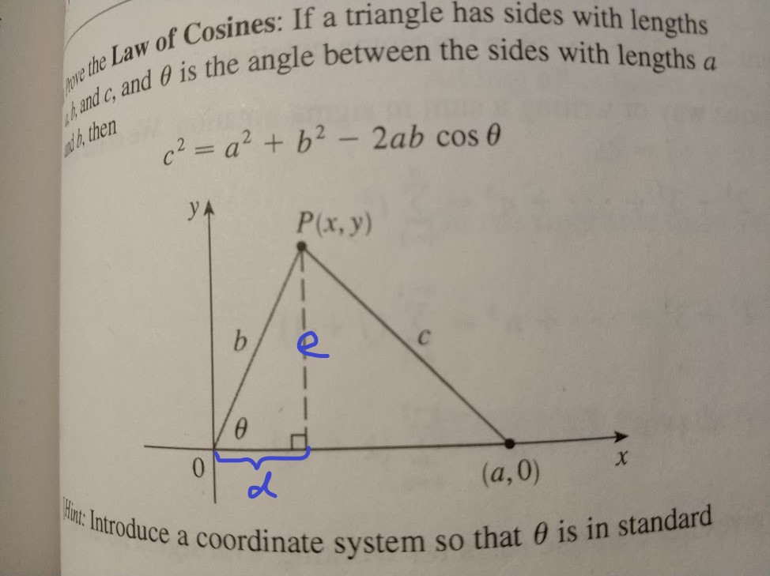
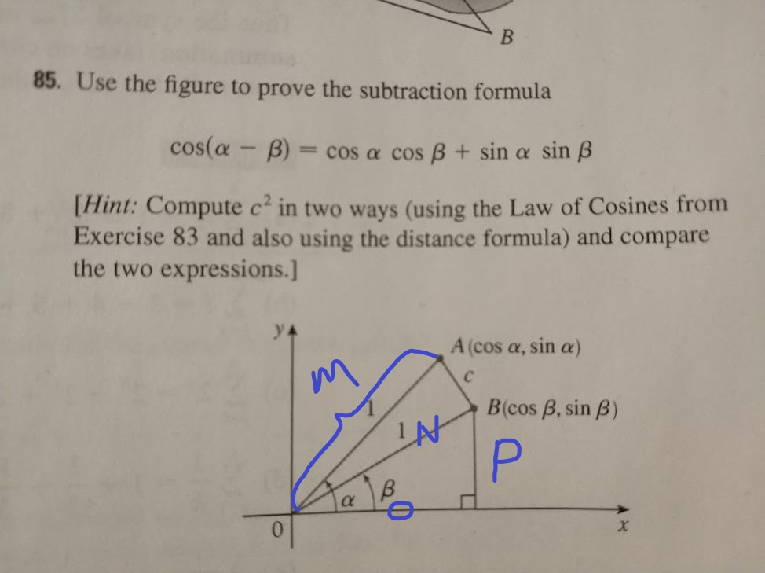

# 三角函数证明

## 公式

$$sin(x+y)=sinxcosy+cosxsiny$$
$$cos(x+y)=cosxcosy-sinxsiny$$
$$sin(x-y)=sinxcosy-cosxsiny$$
$$cos(x-y)=cosxcosy+sinxsiny$$

## 证明

$$cos(x-y)=cosxcosy+sinxsiny$$

证明:

由上图可得
$$sin\theta = e/b$$,
$$cos\theta = d/b$$,
即：$$e = sin\theta * b$$,
 $$d = cos\theta * b$$.

由：
$$ c^2 = e^2 + (a-d)^2$$
带入上式得：
$$ c^2 = (sin\theta *b )^2+ a^2 + (cos\theta * b)^2 - 2ab*cos\theta $$

化简得：$c^2 = a^2 + b^2 -2abcos\theta$

由上图得
$$c^2 = M^2 + N^2 - 2MNcos(\alpha - \beta)$$

化简得
$$c^2 = 2 - 2cos(\alpha - \beta)$$ (1)

又由
$$c^2 = (cos\alpha - cos\beta)^2 - (sin\alpha - sin\beta)^2$$

化简得
$$c^2 = 2 - 2*(cos\alpha)(cos\beta)-2*(sin\alpha)(sin\beta)$$ (2)

由1,2 两式得
$$cos(\alpha-\beta) = (cos\alpha)(cos\beta) + (sin\alpha)(sin\beta)$$

由上式和$cosx$ 为偶函数 $sinx$ 为奇函数得

$$
cos(\alpha + \beta) =
cos(\alpha - (-\beta)) =
(cos\alpha)(cos(-\beta)) + (sin\alpha)(sin(-\beta)) =
(cos\alpha)(cos\beta) - (sin\alpha)(sin\beta)
$$

由 $sin(\pi/2 - \theta) = cos\theta$, $cos(\pi/2 - \theta) = sin\theta$

$$
sin(\alpha + \beta) =
cos(\pi/2 - \alpha - \beta) =
cos(\pi/2 - \alpha)cos(\beta) + sin(\pi/2-\alpha)sin(\beta) =
sin(\alpha)cos(\beta) + cos(\alpha)sin(\beta)
$$

同理

$$
sin(\alpha - \beta) =
cos(\pi/2 - \alpha + \beta) =
cos(\pi/2 - \alpha)cos(\beta) - sin(\pi/2 - \alpha)sin(\beta) =
sin(\alpha)cos(\beta) - cos(\alpha)sin(\beta)
$$